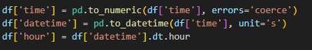
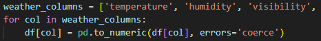
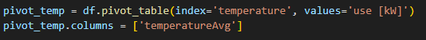
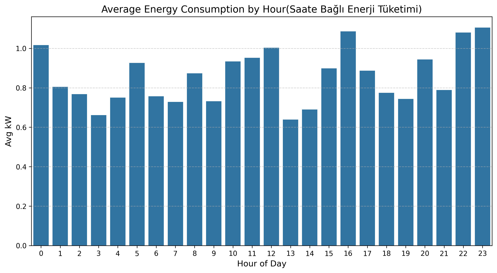
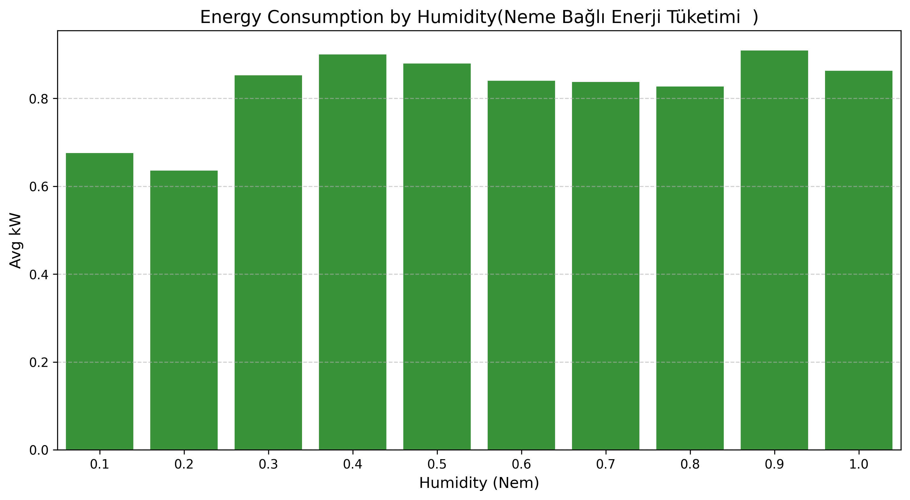
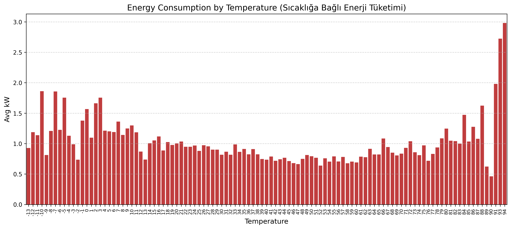
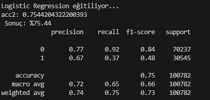
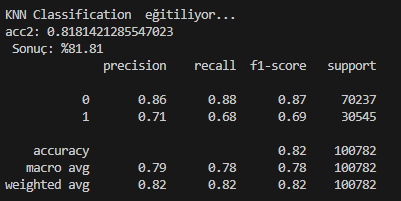
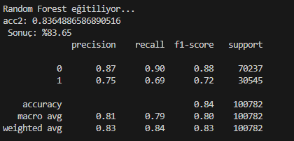

# Akıllı Ev Enerji Tüketimi Tahmini Projesi

Bu proje amaç akıllı ev verilerini , hava durumunu ve bazı diğer ortam verilerini (Sıcaklık, Nem) kullanarak evin enerji tüketiminin ortalamanın üzerinde olup olmadığını tahmin etmektir.Geliştirilen projede 3 farklı makine öğrenmesi modeli kullanılmıştır.

# Veri Seti ve Ön Hazırlık

Projede Smart Home Dataset.csv veri seti kullandım. 
İlk adımda veri setindeki eksik değere sahip sutünları temizledim (Fazlasıyla veri olduğu için silmek sorun olmayacaktır).                     
                              
Zaman bilgisi saniye cinsinden olduğu için okunabilir tarih formatına çevirip daha sonra saate çevirdim.                            
                             

Bu işlem sayesinde model, günün hangi saatinde enerji tüketiminin arttığını veya azaldığını öğrenebilir hale gelmiştir.

Hava durumu ile ilgili sıcaklık, nem, rüzgar hızı gibi sütunları da sayısal formata dönüştürdüm.
                          

# Pivot Nedir ve Neden Kullanılır
Pivotun ne olduğunu ve neden kullanıldığını anlamak için basit bir örnek verebilirim.   
Basit bir satış listesi düşünün bu listede şu tarz veriler olsun.
- Ali / Elma aldı / 15 TL
- Mehmet / Armut aldı / 8 TL
- Ayşe / Elma aldı / 15 TL
- Semih / Muz aldı / 17 TL
- Ali / Elma Aldı / 15 TL
- ...

            
Bu tarz bir Listeye bakarak bu satış listesinde KAÇ ELMA SATILDI sorusunun cevabını bulmak çok zor olur.
Bu sorunu çözmek için pivot kullanılır. Bu listenin elma ürününe göre pivotlanmış hali yüzlerce satır arasında şunu gösterir.

- Ürün    |   Toplam Satış
- Elma    |   45 TL

Ben kodumda pivotu binlerce satır verinin arasından (Örneğin sıcaklık için) 
- Hava "X" dereceyken bu ev ortalama ne kadar enerji harcıyor
- Rüzgar Hızı "X" iken evde ortalama ne kadar enerji harcanıyor 
gibi sorulara cevap verebilmesi için kullandım.

Pivot hale getirilmiş sıcaklık değeri

# Veri Analizi Grafikleri

Enerji tüketiminin farklı koşullara göre nasıl değiştiğini görmek için grafikler oluşturdum.

### Saate Göre Enerji Tüketimi
              

### Neme Göre Enerji Tüketimi
             

### Sıcaklığa Göre Enerji Tüketimi
             

# Hedef Değişken ve Ölçeklendirme

Tahmin edilmek istenen değer enerji tüketimidir. Bu problemi sınıflandırmaya(classification) çevirdim :

- Tüketim ortalamanın üzerindeyse: 1  
- Tüketim ortalamanın altındaysa: 0  

Özellikler arasında sayısal fark çok olduğu için StandardScaler kullandım. 
Not: Herhangi bir ölçceklendirme kullanmadan denediğimde Train kısmı çok uzun sürüyordu özellikle Logistic Regression modelinde. O yüzden StandartScaler kullandım.

# Modellerin Eğitimi ve Sonuçlar

Veriyi %80 eğitim, %20 test olacak şekilde ayırdım. 
3 Farklı modelde sonuçları inceledim

- Lojistik Regresyon  
- KNN (K-Nearest Neighbors)  
- Random Forest  

### Logistic Regression Sonuçları
                          
Logistic Regression diğer modellere göre daha uzun sürmesine rağmen en başarısız model oldu.

### KNN Sonuçları
                        
%81 accuracy skoru ile Logistic Regressiondan başarılı Random Forest'tan başarısız oldu

### Random Forest Sonuçları                        
                        
%83 accuracy skoru ile En başarılı sonucu veren model Random Forest oldu.

# Feature'ların Önem Sırası

Enerji tüketimini tahmin ederken hangi özelliklerin daha etkili olduğunu analiz ettim. Özellikle pivot tablolar ile eklenen ortalama tüketim özelliklerinin (hourAvg, temperatureAvg vb.) model üzerinde önemli bir etkisi olduğu görülebilir.

## Genel Değerlendirme

- Random Forest modeli %83'ün üzerinde sonuç alarak en başarılı sonucu verdi.
- Baseline oluşturarak elde edilen referans noktaları, tüketimi (düşük, yüksek)sınıflandırmada yardımcı oldu
- Saat ve hava durumu bilgileri enerji tüketimini ciddi şekilde etkilediği görüldü.(Özellik Önem tablosunda)
- Pivot tabloları, sade verisetindeki karmaşıklıktan kurtarıp veriyi gruplandırmada çok işlevsel bi araç oldu.

